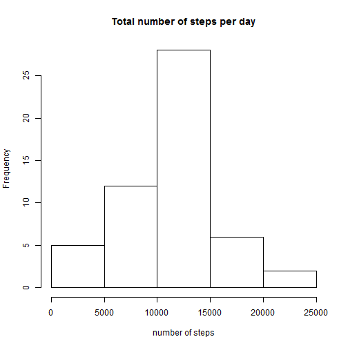
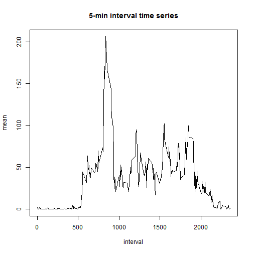
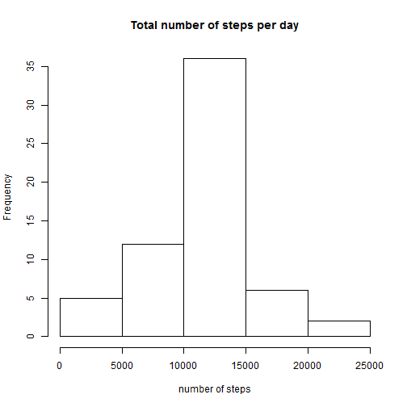

# Reproducible Research: Peer Assessment 1

## some changes to set the correct locale

```r
old_locale <- Sys.getlocale("LC_TIME")
Sys.setlocale("LC_TIME", "English")
```


## Loading and preprocessing the data

Load the data with read.csv and colClasses-Parameter for correct column-class.


```r
library(data.table)
data <- data.table(read.csv("activity.csv", colClasses = c("integer", "Date", 
    "integer"), header = T))
```


## What is mean total number of steps taken per day?

1. Make a histogram of the total number of steps taken each day
2. Calculate and report the mean and median total number of steps taken per day

First the calculation of the total number of steps by day.


```r
q1 <- data[complete.cases(data), list(sum = sum(steps)), by = date]
```


Answer to part 1), the Histogram.


```r
hist(q1$sum, main = "Total number of steps per day", xlab = "number of steps")
```

 


and part 2)

The mean of total number of steps:

```r
mean(q1$sum)
```

```
## [1] 10766
```


The median of total number of steps:

```r
median(q1$sum)
```

```
## [1] 10765
```


## What is the average daily activity pattern?

1. Make a time series plot (i.e. type = "l") of the 5-minute interval (x-axis) and the average number of steps taken, averaged across all days (y-axis)
2. Which 5-minute interval, on average across all the days in the dataset, contains the maximum number of steps?

First group the data by inteval and calculate the mean number of steps, then plot the time series

```r
q2 <- data[complete.cases(data), list(mean = mean(steps)), by = interval]
```


To answer the 1. question, plot the data

```r
plot(q2$interval, q2$mean, type = "l", xlab = "interval", ylab = "mean", main = "5-min interval time series")
```

 


To answer the 2. question, get the interval of the dataset which mean value equals the maximum mean value

```r
q2[q2$mean == max(q2$mean), ]$interval
```

```
## [1] 835
```


## Imputing missing values

1. Calculate and report the total number of missing values in the dataset (i.e. the total number of rows with NAs)
2. Devise a strategy for filling in all of the missing values in the dataset. The strategy does not need to be sophisticated. For example, you could use the mean/median for that day, or the mean for that 5-minute interval, etc.
3. Create a new dataset that is equal to the original dataset but with the missing data filled in.
4. Make a histogram of the total number of steps taken each day and Calculate and report the mean and median total number of steps taken per day. Do these values differ from the estimates from the first part of the assignment? What is the impact of imputing missing data on the estimates of the total daily number of steps?

To answer the 1. question, summarize the true/false values for complete cases on the data

```r
sum(!complete.cases(data))
```

```
## [1] 2304
```


To answer the 2. question some checks have to be done.
First evaluate wich column has NA values:


```r
sum(is.na(data$date))
```

```
## [1] 0
```

```r
sum(is.na(data$interval))
```

```
## [1] 0
```

```r
sum(is.na(data$steps))
```

```
## [1] 2304
```


Only column "steps" has NA values.
For part 3. a new dataset with the imputed values has to be created.
Therefore we distribute the mean value of the same 5-minute interval of all other days to the NA values of the steps column.


```r
require(plyr)
```

```
## Loading required package: plyr
```

```r
impute.mean <- function(x) replace(x, is.na(x), mean(x, na.rm = TRUE))
q3 <- data.table(ddply(data, ~interval, transform, steps = impute.mean(steps)))
```


In part 4. a new histogram and die mean and median values (previous steps) have to be calculated with the new dataset.

The histogram slightly differs from the histogram of part 1:

```r
hist(q3[, list(sum = sum(steps)), by = date]$sum, main = "Total number of steps per day", 
    xlab = "number of steps")
```

 

The mean of total number of steps:

```r
mean(q3[, list(sum = sum(steps)), by = date]$sum)
```

```
## [1] 10766
```


The median of total number of steps differ from part 1 of the assignment and is now equal to the mean:

```r
median(q3[, list(sum = sum(steps)), by = date]$sum)
```

```
## [1] 10766
```


## Are there differences in activity patterns between weekdays and weekends?

1. Create a new factor variable in the dataset with two levels - "weekday" and "weekend" indicating whether a given date is a weekday or weekend day.

2. Make a panel plot containing a time series plot (i.e. type = "l") of the 5-minute interval (x-axis) and the average number of steps taken, averaged across all weekday days or weekend days (y-axis). The plot should look something like the following, which was creating using simulated data:


Creating a factor variable with ifelse-statement using the weekdays function:


```r
q3$week_ind <- as.factor(ifelse(weekdays(q3$date) %in% c("Saturday", "Sunday"), 
    "weekend", "weekday"))
```


Now the plotting in lattice.


```r
library(lattice)
q4 <- q3[, list(mean = mean(steps)), by = list(interval, week_ind)]
xyplot(mean ~ interval | week_ind, data = q4, type = "l", layout = c(1, 2), 
    xlab = "Interval", ylab = "Number of Steps")
```

 


## set locale back to default

```r
Sys.setlocale("LC_TIME", old_locale)
```


